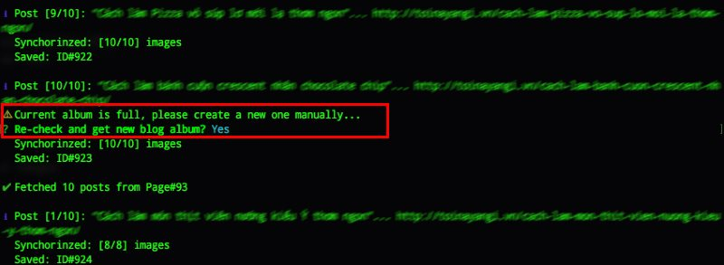

Press2Blogger
==========

A node command line application (CLI) that could help you move or backup your current website from Wordpress to Blogger.

This is still in its early stages of development, so do expect bugs and errors. So that, please [open issue here](https://github.com/lbngoc/press2blogger/issues/new) to make it better. Your contributions are very welcome!

> `press2blogger` is written in TypeScript using [oclif](https://oclif.io) (a Node.JS Open CLI Framework).

# Requirements

- Node 8.0+

# Installation

    $ npm install -g press2blogger

<!-- usage -->
# Usage

**USAGE**

    $ press2blogger [WP_SITE_URL] [BLOGGER_ID]

**OPTIONS**

    -f, --force        update post in local storage if exists
    -h, --help         show CLI help
    -l, --limit=limit  <number> maximum post items to fetch (default: all)
    -o, --output       <boolean> get posts from local storage and generate XML file
    -p, --publish      <boolean> publish a post after synchronizing
    -s, --start=start  <number> start page to fetch (default: 1) or start offset to query from local storage (default: 0)
    -u, --upload       <boolean> upload post images from host to blogger (picasa)
    -v, --version      show CLI version

# Examples

1. Backup all posts from `http://wp-themes.com` to my sample blogger `http://press2blogger.blogspot.com` _(using v1.0.0)_

2. ...
_More examples will come soon !_

# FAQs

1. Current album is full, please create a new one manually...

> Because Google was not allow create an album by API anymore.. so that when facing this warning, you should create an album manually before continue
>  - Open your browser and create/edit a post on your current blog
>  - Click "Insert Image" on toolbar, then upload an picture from computer.
>  - After upload success, Google Photos will create new album for your blog, you can back to the console and confirm "Yes" to continue

# Change Logs

**1.0.2**
- Check and re-create access_token everytime before calling APIs
- Prompt user to retry upload/download images when fail

**1.0.1**

- Support some options: `--upload`, `--publish`, `--start`, `--limit`, `--output`
- Make output messages more beautiful
- Fix some minor bugs when synchorinzing post and images

**1.0.0**

- First release with simple commnand

# TODO

[ ] Check if image is already exist then skipping download/upload

# License

MIT &copy; [Ngoc L.B.](https://ngoclb.com/project/press2blogger)