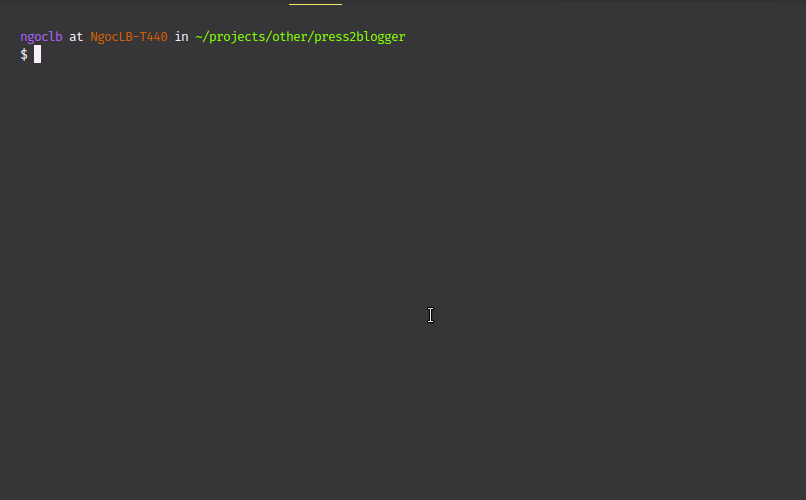

Press2Blogger
==========

A small tool that could help you move or backup your current website from Wordpress to Blogger

<!-- 

 -->

<!-- toc -->

# Usage
<!-- usage -->

**Currently, I have try fixing some small bugs and then publish it to _npmjs.com_.
Keep watching my repo to get latest news.**

# License

MIT &copy; [Ngoc L.B.](https://ngoclb.com/project/press2blogger)